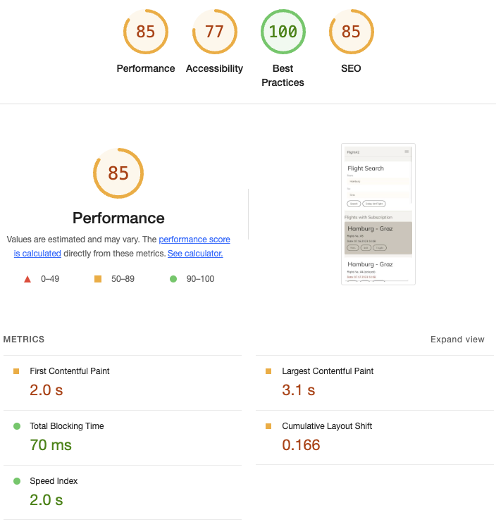
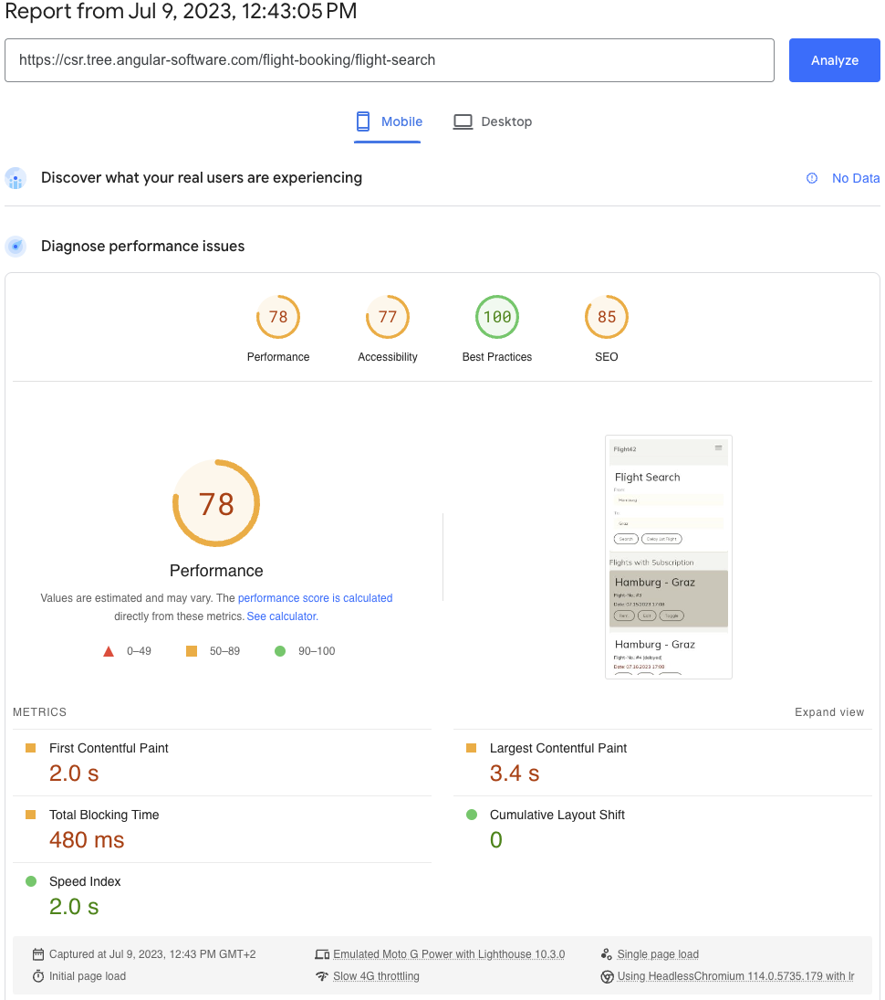
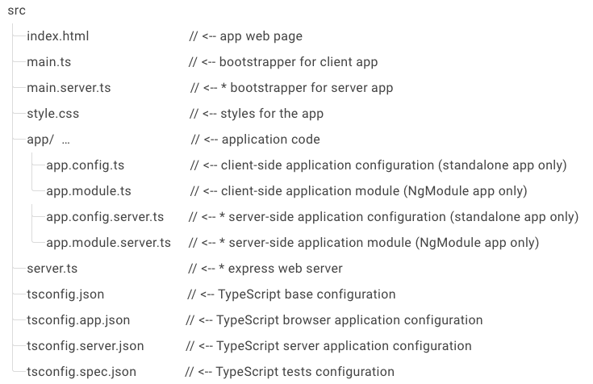
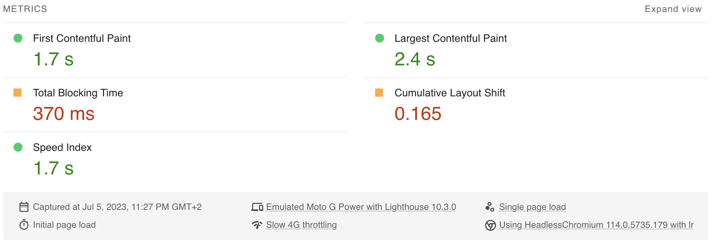

# A complete guide to Angular 16 Server Side Rendering with Client Hydration

<!-- TOC -->

- [A complete guide to Angular 16 Server Side Rendering with Client Hydration](#a-complete-guide-to-angular-16-server-side-rendering-with-client-hydration)
  - [What this project is about](#what-this-project-is-about)
    - [Links to source code and demos](#links-to-source-code-and-demos)
  - [Part I: Why is Initial Load Performance so important?](#part-i-why-is-initial-load-performance-so-important)
    - [How can Server Side Rendering improve performance?](#how-can-server-side-rendering-improve-performance)
    - [Why is Hydration such a breakthrough improvement?](#why-is-hydration-such-a-breakthrough-improvement)
    - [Conclusion](#conclusion)
  - [Part II: How to measure Initial Load Performance](#part-ii-how-to-measure-initial-load-performance)
    - [Basic Initial Load Performance test](#basic-initial-load-performance-test)
    - [Initial Load Performance metrics](#initial-load-performance-metrics)
    - [Initial Load Performance tools](#initial-load-performance-tools)
    - [Conclusion](#conclusion-1)
  - [Part III: How to use Angular SSR with Hydration](#part-iii-how-to-use-angular-ssr-with-hydration)
    - [The base case using Client Side Rendering](#the-base-case-using-client-side-rendering)
    - [Step 1 - Implementing Server Side Rendering](#step-1---implementing-server-side-rendering)
    - [Step 2 - Implementing Prerendering of routes](#step-2---implementing-prerendering-of-routes)
    - [Step 3 - Enabling Non-Destructive Hydration](#step-3---enabling-non-destructive-hydration)
  - [Conclusion](#conclusion-2)
  - [Performance Deep Dive Workshop](#performance-deep-dive-workshop)
  <!-- TOC -->

## What this project is about

It's been a long time (more than 6 years) since we first blogged about [server side rendering (SSR) in Angular](server-side-rendering-with-angular).

The **Angular framework** has recently fallen a bit behind against its competitors - other popular frontend solutions like [React](https://react.dev/blog/2022/03/29/react-v18#new-client-and-server-rendering-apis) and [VueJS](https://vuejs.org/guide/scaling-up/ssr.html#why-ssr) or newer kids on the block like [Svelte](https://svelte.dev/docs/server-side-component-api) and [Qwik](https://qwik.builder.io/docs/guides/static-site-generation/) - concerning Initial Load Performance best practices when it comes to SSR.

However, this has dramatically changed with the [**Version 16** release of Angular](https://blog.angular.io/angular-v16-is-here-4d7a28ec680d)! But that's not the end of the story as the Angular team has announced [plans in their **roadmap**](https://angular.io/guide/roadmap#explore-hydration-and-server-side-rendering-improvements) to further improve SSR by polishing full hydration and exploring the dynamically evolving space of partial hydration and resumability.

So, in this **project** I want to share a **complete guide** 🥳 to implementing **SSR with Client Hydration** in Angular 16 including how to **measure the improvements**.

We'll use the infamous **Flight App** ✈️ created by [Manfred Steyer](https://twitter.com/ManfredSteyer) as an example and serve the two app variants via **Docker** using a [nginx](https://www.nginx.com/) container for the classical client side rendering (CSR) approach and a [Node.js](https://nodejs.org/) server for the SSR variant - both in their alpine versions.

### Links to source code and demos

To help understanding the **Initial Load Optimization process**, I've made commits for the successive steps. You can find the Git repo with all the used source code here:

- https://gitlab.com/L_X_T/ng-performance-demo

Make sure to check out the **live demo web apps** here:

- [Demo Client Side Rendering](https://csr.tree.angular-software.com/)
- [Demo Server Side Rendering](https://ssr.tree.angular-software.com/)

If you want, you can even run the Google PageSpeed Insights tests used to measure the Initial Load Performance by yourself:

- [PageSpeed Client Side Rendering](https://pagespeed.web.dev/analysis?url=https%3A%2F%2Fcsr.tree.angular-software.com%2F)
- [PageSpeed Server Side Rendering](https://pagespeed.web.dev/analysis?url=https%3A%2F%2Fssr.tree.angular-software.com%2F)

## Part I: Why is Initial Load Performance so important?

Let's start with the **why** 🤔! Disclaimer: This section does indeed contain a lot of information and text (which is probably too detailed 😅). If you're already experienced and/or convinced, you can of course **skip this section** and jump to [Part II: How to measure Initial Load Performance](#part-ii-how-to-measure-initial-load-performance) or even [Part III: How to use Angular SSR with Hydration](#part-iii-how-to-use-angular-ssr-with-hydration).

Initial Load Performance is very important for our Angular apps due to its **significant impact** on user experience, engagement, and overall **business success**. When users visit our app, their **first impression** is formed during the initial load, which is the time it takes for the website to fully load and become interactive. This brief period plays a **crucial role** in determining whether a user will stay, engage with the content, and eventually convert into a customer or returning visitor. Here are the key reasons why Initial Load Performance is so freaking important:

1. **User Engagement & Retention**: Users have increasingly high expectations for website performance, and slow-loading websites often lead to frustration and abandonment. Studies have shown that users are more likely to abandon a website if it takes too long to load. By optimizing Initial Load Performance, Angular apps can provide a smooth and seamless user experience, ensuring users stay engaged, explore further, and ultimately stay in the app longer.

2. **Conversion Rates & Revenue**: Slow-loading Angular apps can have a significant negative impact on conversion rates and revenue. Research indicates that even small delays (of 0.1 seconds) in initial load times can result in substantial drops in conversion rates. Users who experience sluggish initial load times are more likely to abandon their shopping carts, leave without making a purchase, or seek alternatives elsewhere. By improving Initial Load Performance, websites can enhance the likelihood of users completing desired actions, such as making a purchase, signing up for a service, or submitting a form, leading to increased revenue and business growth.

3. **Search Engine Optimization (SEO)**: Search engines, especially Google, consider web app performance as one of the main ranking factors (after **content**, of course). Web apps with faster initial load times are often favored in search results, leading to increased visibility and organic traffic. Additionally, slow-loading websites may experience higher bounce rates, which will also negatively impact SEO rankings. By prioritizing Initial Load Performance, web apps can improve their chances of ranking higher in search engine results, attracting more visitors, and gaining a competitive edge.

4. **Mobile Experience**: With the rise of mobile browsing (more than 2/3 of overall traffic in 2023 - just look into your Analytics statistics), optimizing Initial Load Performance is even more critical. Mobile devices often have slower network connections and limited processing power compared to desktop computers. Users accessing your Angular app through mobile devices are typically more sensitive to slow load times and may have less patience when it comes to waiting for an app to load. Therefore, ensuring fast Initial Load Performance is essential to providing a satisfactory mobile experience and catering to the growing mobile user base.

5. **User Satisfaction & Brand Perception**: A fast-loading web app reflects positively on a brand's image and reputation. Users associate slow load times with unprofessionalism, inefficiency, or a lack of care for their experience. On the other hand, an app that loads quickly instills confidence, portrays professionalism, and fosters positive brand perception. By delivering a fast and smooth initial load, web apps can enhance user satisfaction, strengthen brand perception, and establish trust with their audience.

Okay, I hope I have convinced you that you need to improve your Angular apps' initial load as much as possible.

### How can Server Side Rendering improve performance?

Server-side rendering (SSR) can greatly enhance initial load time and contribute to a faster web app experience. Unlike client-side rendering, where the browser must wait for all JavaScript and data to be downloaded before rendering the page, SSR **generates the HTML on the server** and sends a fully rendered page to the browser.

This approach eliminates the need for additional round trips between the client and the server, reducing latency and improving Initial Load Performance. By delivering pre-rendered content, SSR enables users to see and interact with the app faster, as there is no delay in rendering or waiting for data to be fetched.

This results in a quicker time to first paint and an improved perception of speed, leading to enhanced user satisfaction and engagement. Additionally, SSR assists with search engine optimization by providing search engines with fully rendered HTML, making the website more accessible and discoverable.

### Why is Hydration such a breakthrough improvement?

Hydration is a technique that complements server-side rendering (SSR) and improves the initial load time of SSR-rendered pages: After the initial HTML is rendered on the server and sent to the client, hydration involves re-rendering the components on the client-side and **attaching event handlers**. This process allows the static HTML to be transformed into an interactive and dynamic application.

The main benefit of the so-called **Non-Destructive Hydration** introduced in Angular V16 is that the DOM does not have to be rerendered completely in the client which often showed up in a blank flash of the page during the process - which of course resulted in a very bad user experience. If you'd ask me personally I'd say for that reason SSR was not really usable in Angular until now!

Here's how hydration further improves SSR:

1. **Interactivity & Responsiveness**: By hydrating the server-rendered HTML on the client-side, the page becomes interactive and responsive to user actions. Components can be initialized with their previous state and reattach event listeners, enabling seamless interactivity without reloading the entire page. This provides a smoother user experience, making the web app feel more dynamic and responsive.

2. **Faster Time 2 Interactive**: Hydration bridges the gap between SSR and client-side rendering (CSR) by allowing the page to become interactive sooner. While SSR delivers a pre-rendered page to the client, hydration takes over on the client-side, allowing components to be re-rendered and initialized faster. This reduces the time it takes for the page to become fully interactive, enhancing the overall user experience and perceived speed.

3. **SEO & Social Sharing**: Hydration helps with search engine optimization (SEO) and social sharing by providing search engine crawlers and social media bots with fully interactive content. While SSR provides initial content for search engines to index, hydration ensures that the full interactivity and dynamic behavior of the page are preserved, enabling search engines and social media platforms to accurately represent and display the web app's content.

### Conclusion

Initial Load Performance directly impacts user engagement, conversion rates, SEO rankings, mobile experience, and overall brand perception. Investing in optimizing initial load times can yield significant benefits, ensuring users have a positive experience, increasing conversions, and driving business success in the digital landscape.

In the following part II I'll show you how to measure the Initial Load Performance.

## Part II: How to measure Initial Load Performance

In **part I**, we explored the advantages of achieving excellent Performance, particularly emphasizing a swift Initial Load<!-- @Manfred, please insert link here as well -->. In this section, we delve into the process of measuring our own property's performance. Assessing the Initial Load Performance of a web app is crucial for comprehending its speed and pinpointing areas that require enhancement.

### Basic Initial Load Performance test

A first and simple test can be to fire up the Chrome/Chromium Dev Tools.

<p align="center">


Illustration: Google Chrome Dev Tools network tab

</p>

There we see this three essential measurements:

1. **DOMContentLoaded** (blue vertical line): This document event is fired when the initial HTML document has been completely downloaded and parsed.

2. **Load** (red vertical line): This window event is fired on fully load page, so when HTML (1) and the BLOCKING resources (CSS & JS) are downloaded and parsed.

3. **Finish**: The loading is finished completely when (1) & (2) and also the NON-BLOCKING JS resources are downloaded & parsed and all the XMLHttpRequests and Promises are completed.

To gain deeper insights, we can utilize specialized tools such as **Google Lighthouse**, **Google PageSpeed**, or **Webpagetest.org**, which provide more comprehensive measurements. This guide outlines several common metrics for evaluating Initial Load Performance:

### Initial Load Performance metrics

In my opinion, the most crucial measurement should always be an initial evaluation performed by a human being, such as the developer. It is imperative to ensure that **everything functions as intended** and that no errors are present, **both visually and in the browser's Dev Console**. This hands-on approach guarantees that the website performs optimally and provides a seamless user experience.

Additionally, an E2E Testing setup with Cypress or Playwright can help to avoid running measurements tests on broken apps.

Following that initial assessment, I recommended to start measuring these metrics:

- [**First Contentful Paint (FCP)**](https://web.dev/fcp/): FCP is an important, user-centric metric for measuring perceived load speed because it marks the first point in the page load timeline where the user can see anything on the screen - a fast FCP helps reassure the user that something is happening.

- [**Largest Contentful Paint (LCP)**](https://web.dev/lcp/): LCP is an important, stable Core Web Vital metric for measuring perceived load speed because it marks the point in the page load timeline when the page's main content has likely loaded - a fast LCP helps reassure the user that the page is useful.

- [**Total Blocking Time (TBT)**](https://web.dev/tbt/): TBT is an important metric for measuring load responsiveness because it helps quantify the severity of how non-interactive a page is prior to it becoming reliably interactive - a low TBT helps ensure that the page is usable.

- [**Cumulative Layout Shift (CLS)**](https://web.dev/cls/): CLS is a stable Core Web Vital metric. It is an important, user-centric metric for measuring visual stability because it helps quantify how often users experience unexpected layout shifts - a low CLS helps ensure that the page is delightful.

- [**Speed Index (SI)**](https://docs.webpagetest.org/metrics/speedindex/): The SI is an old and well known metric introduced by Webpagetest.org (more details below). It is the average time at which visible parts of the page are displayed. It might be also dependent on size of the view port.

Naturally, this selection of metrics is not exhaustive. However, by exploring these metrics, Angular app developers can obtain valuable insights into the Initial Load Performance of their web apps. Such information is instrumental in identifying optimization opportunities, prioritizing improvements, and ultimately enhancing the overall user experience (as discussed in part I).

### Initial Load Performance tools

The tools not only provide a performance score but also offer actionable recommendations for improvement. Furthermore, they assist in optimizing CSS, JavaScript, images and server settings. Here is my **TOP 3 selection** of the most helpful tools to consider:

- [**Google Chrome Lighthouse extension**](https://chrome.google.com/webstore/detail/lighthouse/blipmdconlkpinefehnmjammfjpmpbjk?hl=de): To use the Lighthouse Dev Tools we need to download and install the Lighthouse extension. This tool audits any web page - even on localhost or behind a login - for performance, accessibility, SEO, and best practices. Just like PageSpeed (which under the hood uses Lighthouse as well) it provides scores and recommendations to improve load times, accessibility, and adherence to standards.

  <p align="center">
  

  Illustration: Google Chrome Lighthouse extension
  </p>

  A final note about the Performance Score (from 0 to 100): Some important metrics contribute to the [score (see details)](https://developer.chrome.com/docs/lighthouse/performance/performance-scoring/). The score is getting stricter over time - so if you had a sweet 100, 5 years ago, you might only get a 50 today - with the same performance.

  When testing an **Angular app** you need to be a bit indulgent with the overall scoring. I'm following these ratings (purely made up by myself!):

  - 0 - 20 Very bad score, you should consider firing somebody
  - 20 - 40 Bad score, definitely needs some work
  - 40 - 55 Okayish score, should still get better
  - 55 - 70 Good score, still room for improvement
  - 70 - 80 Very good score. Maybe 1 or 2 tweaks
  - 80 - 90 Wow, perfect score - congratulations!
  - 90 - 100 Okay, that's probably a fake!

- [**Google PageSpeed Insights**](https://pagespeed.web.dev/): It is a free tool by Google that assesses the performance of (publicly available) web pages. It calculates an overall score and measures all of the above metrics. PageSpeed shows you two different results: The first is done in real world - collected by real users, if your app has had enough visitors - and the second is a lab test using [**Google Lighthouse**](https://developer.chrome.com/docs/lighthouse/overview/) on the Google servers.

  <p align="center">
  

  Illustration: Google PageSpeed Insights
  </p>

  If you wondering why the results of the two Lighthouse variants differ 🤷 I can only say that's something we have to live with. Here is a comparison between the two tools:

  <p align="center">
  

  Illustration: Google PageSpeed vs Lighthouse
  </p>

- [**Webpagetest.org**](https://www.webpagetest.org/): WebPageTest.org is an old and very wll-known web performance tool providing diagnostic information about how a web page performs under a variety of conditions. WebPageTest uses the same metrics as Google Lighthouse. It offers an online version where each test can be run from different locations around the world, on real browsers, over any number of customized network conditions. It's basically an alternative to PageSpeed Insights with more configuration options.

  <p align="center">
  

  Illustration: Webpagetest.org
  </p>

### Conclusion

In this guide I showed you how can easily measure and compare your Initial Load Performance. Using performance measurement metrics and tools is essential to assess your Angular app's speed, user experience, and identify areas for improvement. The tools provide objective data, identify bottlenecks, offer user-centric insights, enable benchmarking, provide optimization recommendations, and support ongoing monitoring for continuous improvement.

In the following part III I'll show you how to use Angular SSR with Hydration. I'll be using PageSpeed Insights to measure the Initial Load Performance improvements.

## Part III: How to use Angular SSR with Hydration

All the source code being used in this demo including the following steps can be found here: https://gitlab.com/L_X_T/ng-performance-demo

I use the Flight App as the demonstration example. It is a small and simple Angular app. To get realistic results and timings we've added some links to big CSS files (by Bootstrap) and a big Chart library (by AnyChart) - the latter being lazy-loaded at least.

Besides, all of that is running on a very cheap virtual server, actually the cheapest virtual root server offering by [netcup.de](https://www.netcup.de/vserver/). So please don't expect world breaking records here - we just want to demonstrate the improvements by adding SSR, Prerendering & Client Hydration.

### The base case using Client Side Rendering

We want to use a `nginx` container to serve our Angular app called `performance`.

```dockerfile
# Stage 0, Node.js, install deps & build the app
FROM node:16-alpine as builder

# set working directory
RUN mkdir -p /usr/src/app
WORKDIR /usr/src/app

# add app
COPY . /usr/src/app

# install deps and cli
RUN npm install
RUN npm install -g @angular/cli

# add .bin to $PATH
ENV PATH /usr/src/app/node_modules/.bin:$PATH

# build app
RUN ng build

# Stage 1, nginx, copy & serve app
FROM nginx:alpine

COPY --from=builder /usr/src/app/dist/performance/browser /usr/share/nginx/html/
COPY nginx.conf /etc/nginx/conf.d/default.conf
```

Please note that in this `Dockerfile` we assume that `Angular Universal` is already set up and therefore the Angular app resides in a subfolder called `browser`.

To enable **gzip compression** in nginx we need to modify the default nginx.conf. Make sure to add all mime-types that your app is using.

```text
server {
    gzip on;
    gzip_types      application/javascript font/woff image/jpg image/png image/webp image/x-icon text/css text/plain;
    gzip_proxied    no-cache no-store private expired auth;
    gzip_min_length 1024;

    server_name localhost;
    listen      80;
    root        /usr/share/nginx/html;
    index       index.html;

    location / {
        try_files $uri $uri/ /index.html;
    }
}
```

Since we want to serve our Flight App via `https`, we also need to use the secure version of our Flight API.

```diff
-  url = 'http://www.angular.at/api/flight';
-  // url = 'https://demo.angulararchitects.io/api/Flight';
+  // url = 'http://www.angular.at/api/flight';
+  url = 'https://demo.angulararchitects.io/api/Flight';
```

Now let's run our first test on Google PageSpeed Insights:

<p align="center">


Illustration: Client Side Rendering

</p>

The base case takes 2.2s to show the FCP and 3.8s for the LCP. There is no CLS.

### Step 1 - Implementing Server Side Rendering

To enable Server-Side Rendering we first need to install `Angular Universal`:

```shell
ng add @nguniversal/express-engine
```

This will add the dependencies and all the configuration files needed to run Angular in SSR mode:

<p align="center">


Illustration: Angular Universal Configuration

</p>

Now we want to use a `Node.js` container to serve our Angular app.

`Node.js` is necessary to be able to render the page on the server.

```dockerfile
# Stage 0, Node.js, install deps, build & run the app
FROM node:16-alpine as builder

# set working directory
RUN mkdir -p /usr/src/app
WORKDIR /usr/src/app

# add app
COPY . /usr/src/app

# install deps and cli
RUN npm install
RUN npm install -g @angular/cli

# add .bin to $PATH
ENV PATH /usr/src/app/node_modules/.bin:$PATH

# build app & server
RUN ng build
RUN ng run performance:server

# build default port
EXPOSE 4000

# start server
CMD ["node", "/usr/src/app/dist/performance/server/main.js"]
```

To be able to use this and not having to guess the `main.js` hash we **disable hashing** in the `angular.json`:

```json
"outputHashing": "none",
```

To enable **gzip compression** we firstly need to add the `compression` npm packages:

```shell
npm i compression --save
npm i @types/compression --save-dev
```

Secondly we need to update the `server.ts`:

```diff
-  server.engine('html', ngExpressEngine({
-    bootstrap: AppServerModule
-  }));
+  server.engine(
+    'html',
+    ngExpressEngine({
+      bootstrap: AppServerModule
+    })
+  );
+
+  // Compress all HTTP responses
+  server.use(compression());
```

So, now let's check the results with SSR:

<p align="center">


Illustration: Server Side Rendering

</p>

The server side rendered variant takes 2.0s (-0.2s) to show the FCP and 2.2s (-1.6s) for the LCP. There is a CLS of 0.165 because the page has to be rerendered in the client. It's already much faster than CSR, but you get a CLS which is not good. We can do better than that!

### Step 2 - Implementing Prerendering of routes

Prerendering the routes allows the backend to prerender certain routes which then are cached on the server. So those pages don't have to be prerendered on-the-fly but instead will be delivered from the **static cache** on the server. However, if your App is behind a CDN like CloudFlare which caches each page as well you probably want to omit this step.

In your `Dockerfile` at the following line after build and before the run server:

```dockerfile
# build app, prerender & run server
RUN ng build
RUN ng run performance:prerender
RUN ng run performance:server
```

In your `angular.json` you want to specify which **routes** should be **prerendered**:

```json
"prerender": {
  "builder": "@nguniversal/builders:prerender",
    "options": {
      "routes": ["/", "/home", "/flight-booking/flight-search", "/flight-booking/charts"]
    },
```

Alternatively, you could also use a **text file** for specifying the static pages:

```dockerfile
RUN ng run performance:prerender --routes-file routes.txt
```

Let's check the results with prerendering:

<p align="center">


Illustration: Prerendering of routes

</p>

The prerendered SSR variant takes 1.7s (-0.5s) to show the FCP and 2.4s (-1.4s) for the LCP. There is still a CLS of 0.165 because of the rerendering in the client. It's merely faster than the SSR without prerendering. This is because the Angular app is very simple and thus rendering on the server does not take very long.

### Step 3 - Enabling Non-Destructive Hydration

To enable the **Non-Destructive Hydration** feature in Angular all we need to do is to add this provider in the `AppModule`. Of course this only works if we import it from the `@angular/platform-browser` with at least version 16.

```typescript
// app.module.ts
@NgModule({
  providers: [
    [...],
    provideClientHydration()
  ],
})
export class AppModule {}
```

If you're using the standalone bootstrapping you can add the provider to the `ApplicationConfig`.

```typescript
// app.config.ts
export const appConfig: ApplicationConfig = {
  providers: [
    [...],
    provideClientHydration(),
  ]
};
```

Let's check the final results:

<p align="center">


Illustration: Non-Destructive Hydration

</p>

The SSR with Client Hydration variant takes 1.5s (-0.7s) to show the FCP and 1.5s (-2.3s) for the LCP. There is no CLS. It's blazingly fast and we get rid of the CLS, because the DOM does not have to be rerendered.

## Conclusion

Server Side Rendering is an effective technique for optimizing Initial Load Performance and delivering a faster, more seamless user experience. Angular V16's Non-Destructive Hydration complements SSR by transforming static HTML into an interactive application on the client-side without having to rerender (and thus repaint in the browser) it completely.

By combining the benefits of SSR & Hydration, your Angular apps can deliver faster initial load times, provide a seamless user experience, and achieve better search engine visibility. In the future the Angular framework will deliver even better Hydration support and features.

In this guide I showed you how easy it is to set up Angular SSR with Hydration and how much the Initial Load Performance improves as a result. So, if your Angular app is publicly available you should start using SSR & Hydration today!

## Performance Deep Dive Workshop

If you want to deep dive into Angular performance, we offer a dedicated [**Performance Workshop**](https://www.angulararchitects.io/en/angular-workshops/angular-performance-workshop/) 🚀 - both in English and German.

This project was created by [Alex Thalhammer](https://alex.thalhammer.name/). Follow him on [GitHub](https://github.com/L-X-T), [Twitter](https://twitter.com/LX_T) or [LinkedIn](https://at.linkedin.com/in/thalhammer).
