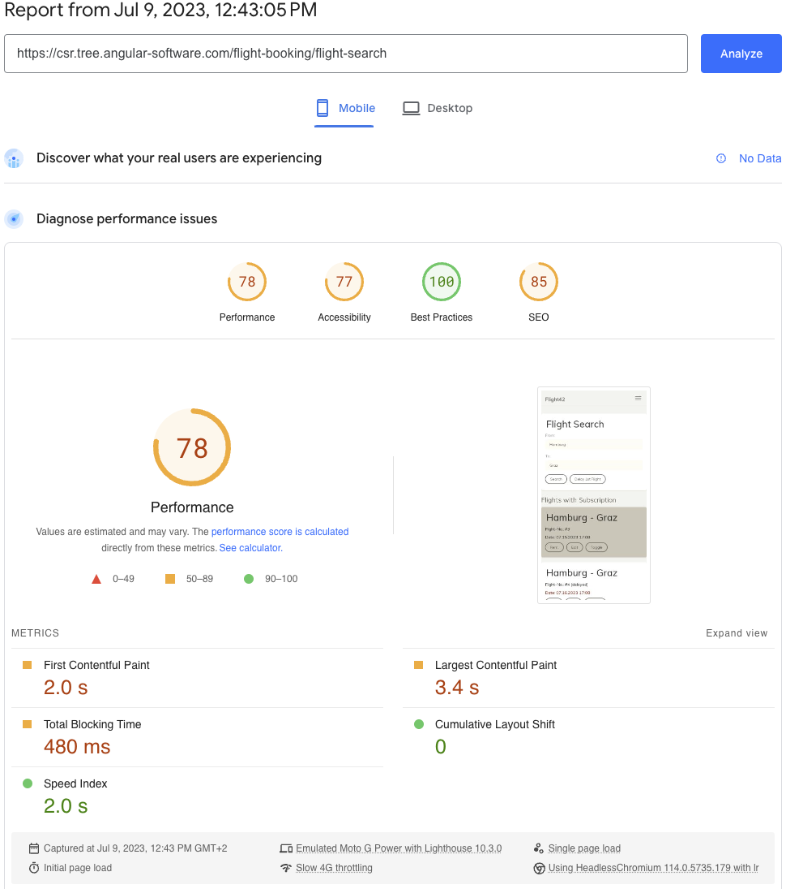
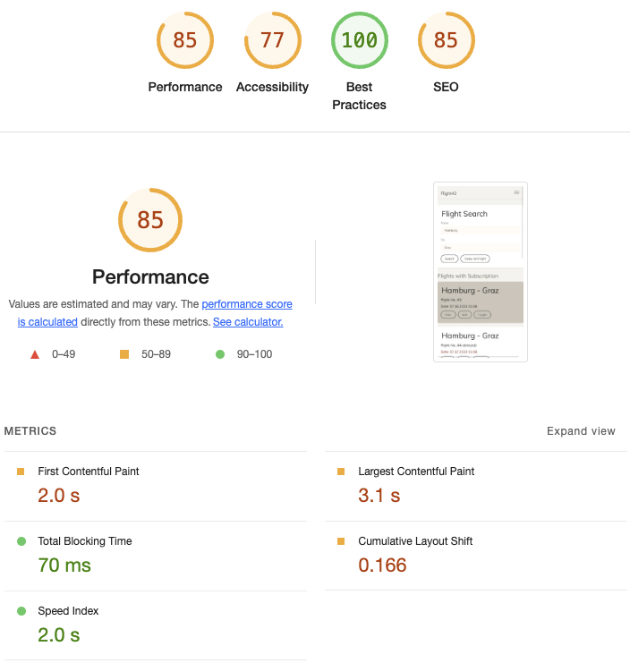
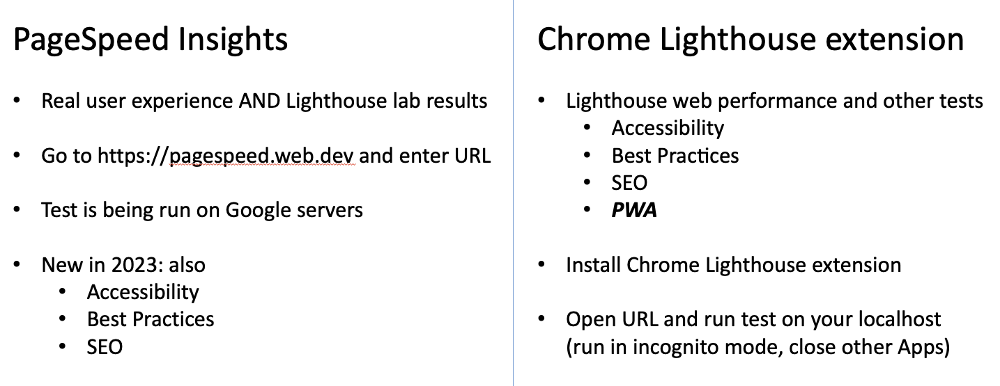
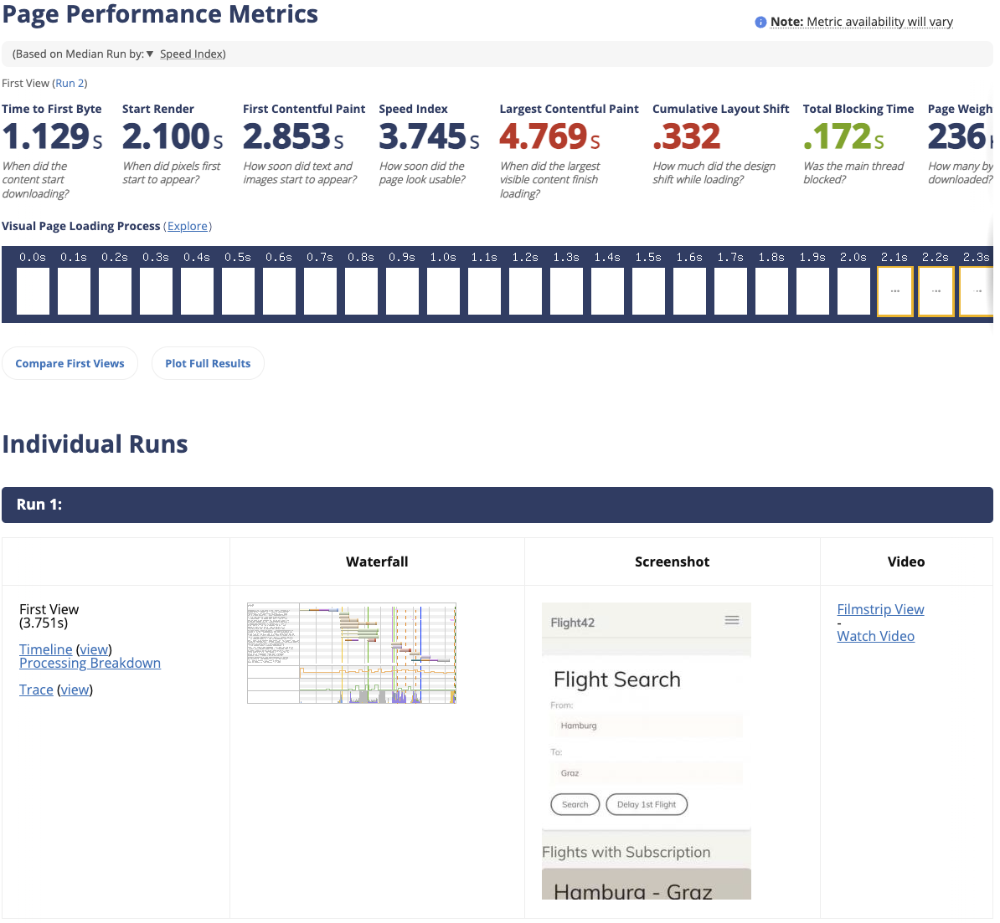

# How to measure Initial Load Performance

Part II of the complete guide to Angular 16 Server Side Rendering with Client Hydration

<!-- TOC -->

- [How to measure Initial Load Performance](#how-to-measure-initial-load-performance)
  - [Initial Load Performance metrics](#initial-load-performance-metrics)
  - [Initial Load Performance tools](#initial-load-performance-tools)
  - [Conclusion](#conclusion)
  - [Performance Deep Dive Workshop](#performance-deep-dive-workshop)
  <!-- TOC -->

In **part I**, we discussed the benefits of having a faster Initial Load<!-- @Manfred, please insert link here as well -->. Now we take a look at how to measure our performance. Measuring the Initial Load Performance of a website is essential to understand its speed and identify areas for improvement. Here are some common metrics to measure Initial Load Performance in this guide:

## Initial Load Performance metrics

- [**First Contentful Paint (FCP)**](https://web.dev/fcp/): FCP is an important, user-centric metric for measuring perceived load speed because it marks the first point in the page load timeline where the user can see anything on the screen - a fast FCP helps reassure the user that something is happening.

- [**Largest Contentful Paint (LCP)**](https://web.dev/lcp/): LCP is an important, stable Core Web Vital metric for measuring perceived load speed because it marks the point in the page load timeline when the page's main content has likely loaded - a fast LCP helps reassure the user that the page is useful.

- [**Total Blocking Time (TBT)**](https://web.dev/tbt/): TBT is an important metric for measuring load responsiveness because it helps quantify the severity of how non-interactive a page is prior to it becoming reliably interactive - a low TBT helps ensure that the page is usable.

- [**Cumulative Layout Shift (CLS)**](https://web.dev/cls/): CLS is a stable Core Web Vital metric. It is an important, user-centric metric for measuring visual stability because it helps quantify how often users experience unexpected layout shifts - a low CLS helps ensure that the page is delightful.

- [**Speed Index (SI)**](https://docs.webpagetest.org/metrics/speedindex/): The SI is an old and well known metric introduced by Webpagetest.org (more details below). It is the average time at which visible parts of the page are displayed. It might be also dependent on size of the view port.

This is, of course, just a selection. By utilizing these metrics, Angular app developers can gain valuable insights into the Initial Load Performance of their websites. This information can help identify areas for optimization, prioritize improvements, and deliver better user experiences.

The first and foremost important measurement should in my opinion still always be an initial check by a human being (i.e. the Developer). We need to ensure that everything works as expected and that there are no errors - both visually or in the Browsers' Dev Console.

After that initial assessment you should use tools to measure metrics like the ones mentioned above. The tools provide a performance score and offer actionable recommendations to improve. They even help optimize CSS, JavaScript, images and server settings. I want to recommend using the following tools:

## Initial Load Performance tools

- [**Google PageSpeed Insights**](https://pagespeed.web.dev/): It is a free tool by Google that assesses the performance of (publicly available) web pages. It calculates an overall score and measures all of the above metrics. PageSpeed shows you two different results: The first is done in real world - collected by real users, if your app has had enough visitors - and the second is a lab test using [**Google Lighthouse**](https://developer.chrome.com/docs/lighthouse/overview/) on the Google servers.

  

- [**Google Chrome Lighthouse extension**](https://chrome.google.com/webstore/detail/lighthouse/blipmdconlkpinefehnmjammfjpmpbjk?hl=de): If for whatever reason our Angular app is not publicly available, we can run the Google Lighthouse on our own machine by using the Lighthouse Chrome extension. This tool audits any web page - even on localhost or behind a login - for performance, accessibility, SEO, and best practices. Just like PageSpeed (which under the hood uses Lighthouse as well) it provides scores and recommendations to improve load times, accessibility, and adherence to standards.

  

  If you wondering why the results of the two Lighthouse variants differ 🤷 I can only say that's something we have to live with. Here is a comparison between the two tools:

  

- [**Webpagetest.org**](https://www.webpagetest.org/): WebPageTest.org is an old and very wll-known web performance tool providing diagnostic information about how a web page performs under a variety of conditions. WebPageTest uses the same metrics as Google Lighthouse. It offers an online version where each test can be run from different locations around the world, on real browsers, over any number of customized network conditions. It's basically an alternative to PageSpeed Insights with more configuration options.

  

## Conclusion

In this guide I showed you how can easily measure and compare your Initial Load Performance. Using performance measurement metrics and tools is essential to assess your Angular app's speed, user experience, and identify areas for improvement. The tools provide objective data, identify bottlenecks, offer user-centric insights, enable benchmarking, provide optimization recommendations, and support ongoing monitoring for continuous improvement.

In the upcoming **part III** I'll show you how to use Angular SSR with Hydration. I'll be using PageSpeed Insights to measure the Initial Load Performance improvements.<!-- @Manfred, please insert link here as well -->

## Performance Deep Dive Workshop

If you want to deep dive into Angular performance, we offer a dedicated [**Performance Workshop**](https://www.angulararchitects.io/en/angular-workshops/angular-performance-workshop/) 🚀 - both in English and German.

This blog series was written by [Alex Thalhammer](https://alex.thalhammer.name/). Follow me on [GitHub](https://github.com/L-X-T), [Twitter](https://twitter.com/LX_T) or [LinkedIn](https://at.linkedin.com/in/thalhammer).
