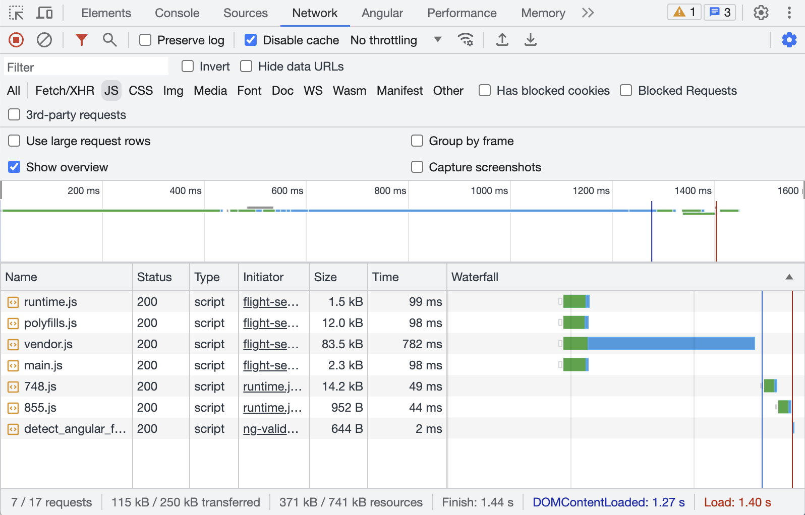

# How to measure Initial Load Performance

Part II of the complete guide to Angular 16 Server Side Rendering with Client Hydration

<!-- TOC -->

- [How to measure Initial Load Performance](#how-to-measure-initial-load-performance)
  - [Basic Initial Load Performance test](#basic-initial-load-performance-test)
  - [Initial Load Performance metrics](#initial-load-performance-metrics)
  - [Initial Load Performance tools](#initial-load-performance-tools)
  - [Conclusion](#conclusion)
  - [Performance Deep Dive Workshop](#performance-deep-dive-workshop)
  <!-- TOC -->

In **part I**, we explored the advantages of achieving excellent Performance, particularly emphasizing a swift Initial Load<!-- @Manfred, please insert link here as well -->. In this section, we delve into the process of measuring our own property's performance. Assessing the Initial Load Performance of a web app is crucial for comprehending its speed and pinpointing areas that require enhancement.

## Basic Initial Load Performance test

A first and simple test can be to fire up the Chrome/Chromium Dev Tools.

Illustration: Google Chrome Dev Tools network tab

There we see this three essential measurements:

1. **DOMContentLoaded** (blue vertical line): This document event is fired when the initial HTML document has been completely downloaded and parsed.

2. **Load** (red vertical line): This window event is fired on fully load page, so when HTML (1) and the BLOCKING resources (CSS & JS) are downloaded and parsed.

3. **Finish**: The loading is finished completely when (1) & (2) and also the NON-BLOCKING JS resources are downloaded & parsed and all the XMLHttpRequests and Promises are completed.

To gain deeper insights, we can utilize specialized tools such as **Google Lighthouse**, **Google PageSpeed**, or **Webpagetest.org**, which provide more comprehensive measurements. This guide outlines several common metrics for evaluating Initial Load Performance:

## Initial Load Performance metrics

In my opinion, the most crucial measurement should always be an initial evaluation performed by a human being, such as the developer. It is imperative to ensure that **everything functions as intended** and that no errors are present, **both visually and in the browser's Dev Console**. This hands-on approach guarantees that the website performs optimally and provides a seamless user experience.

Additionally, an E2E Testing setup with Cypress or Playwright can help to avoid running measurements tests on broken apps.

Following that initial assessment, I recommended to start measuring these metrics:

- [**First Contentful Paint (FCP)**](https://web.dev/fcp/): FCP is an important, user-centric metric for measuring perceived load speed because it marks the first point in the page load timeline where the user can see anything on the screen - a fast FCP helps reassure the user that something is happening.

- [**Largest Contentful Paint (LCP)**](https://web.dev/lcp/): LCP is an important, stable Core Web Vital metric for measuring perceived load speed because it marks the point in the page load timeline when the page's main content has likely loaded - a fast LCP helps reassure the user that the page is useful.

- [**Total Blocking Time (TBT)**](https://web.dev/tbt/): TBT is an important metric for measuring load responsiveness because it helps quantify the severity of how non-interactive a page is prior to it becoming reliably interactive - a low TBT helps ensure that the page is usable.

- [**Cumulative Layout Shift (CLS)**](https://web.dev/cls/): CLS is a stable Core Web Vital metric. It is an important, user-centric metric for measuring visual stability because it helps quantify how often users experience unexpected layout shifts - a low CLS helps ensure that the page is delightful.

- [**Speed Index (SI)**](https://docs.webpagetest.org/metrics/speedindex/): The SI is an old and well known metric introduced by Webpagetest.org (more details below). It is the average time at which visible parts of the page are displayed. It might be also dependent on size of the view port.

Naturally, this selection of metrics is not exhaustive. However, by exploring these metrics, Angular app developers can obtain valuable insights into the Initial Load Performance of their web apps. Such information is instrumental in identifying optimization opportunities, prioritizing improvements, and ultimately enhancing the overall user experience (as discussed in part I).

## Initial Load Performance tools

The tools not only provide a performance score but also offer actionable recommendations for improvement. Furthermore, they assist in optimizing CSS, JavaScript, images and server settings. Here is my **TOP 3 selection** of the most helpful tools to consider:

- [**Google Chrome Lighthouse extension**](https://chrome.google.com/webstore/detail/lighthouse/blipmdconlkpinefehnmjammfjpmpbjk?hl=de): To use the Lighthouse Dev Tools we need to download and install the Lighthouse extension. This tool audits any web page - even on localhost or behind a login - for performance, accessibility, SEO, and best practices. Just like PageSpeed (which under the hood uses Lighthouse as well) it provides scores and recommendations to improve load times, accessibility, and adherence to standards.

  

  

  Illustration: Google Chrome Lighthouse extension
  

  A final note about the Performance Score (from 0 to 100): Some important metrics contribute to the [score (see details)](https://developer.chrome.com/docs/lighthouse/performance/performance-scoring/). The score is getting stricter over time - so if you had a sweet 100, 5 years ago, you might only get a 50 today - with the same performance.

  When testing an **Angular app** you need to be a bit indulgent with the overall scoring. I'm following these ratings (purely made up by myself!):

  - 0 - 20 Very bad score, you should consider firing somebody
  - 20 - 40 Bad score, definitely needs some work
  - 40 - 55 Okayish score, should still get better
  - 55 - 70 Good score, still room for improvement
  - 70 - 80 Very good score. Maybe 1 or 2 tweaks
  - 80 - 90 Wow, perfect score - congratulations!
  - 90 - 100 Okay, that's probably a fake!

- [**Google PageSpeed Insights**](https://pagespeed.web.dev/): It is a free tool by Google that assesses the performance of (publicly available) web pages. It calculates an overall score and measures all of the above metrics. PageSpeed shows you two different results: The first is done in real world - collected by real users, if your app has had enough visitors - and the second is a lab test using [**Google Lighthouse**](https://developer.chrome.com/docs/lighthouse/overview/) on the Google servers.

  

  

  Illustration: Google PageSpeed Insights
  

  If you wondering why the results of the two Lighthouse variants differ 🤷 I can only say that's something we have to live with. Here is a comparison between the two tools:

  

  

  Illustration: Google PageSpeed vs Lighthouse
  

- [**Webpagetest.org**](https://www.webpagetest.org/): WebPageTest.org is an old and very wll-known web performance tool providing diagnostic information about how a web page performs under a variety of conditions. WebPageTest uses the same metrics as Google Lighthouse. It offers an online version where each test can be run from different locations around the world, on real browsers, over any number of customized network conditions. It's basically an alternative to PageSpeed Insights with more configuration options.

  

  

  Illustration: Webpagetest.org
  

## Conclusion

In this guide I showed you how can easily measure and compare your Initial Load Performance. Using performance measurement metrics and tools is essential to assess your Angular app's speed, user experience, and identify areas for improvement. The tools provide objective data, identify bottlenecks, offer user-centric insights, enable benchmarking, provide optimization recommendations, and support ongoing monitoring for continuous improvement.

In the upcoming **part III** I'll show you how to use Angular SSR with Hydration. I'll be using PageSpeed Insights to measure the Initial Load Performance improvements.<!-- @Manfred, please insert link here as well -->

## Performance Deep Dive Workshop

If you want to deep dive into Angular performance, we offer a dedicated [**Performance Workshop**](https://www.angulararchitects.io/en/angular-workshops/angular-performance-workshop/) 🚀 - both in English and German.

This blog series was written by [Alex Thalhammer](https://alex.thalhammer.name/). Follow me on [GitHub](https://github.com/L-X-T), [Twitter](https://twitter.com/LX_T) or [LinkedIn](https://at.linkedin.com/in/thalhammer).
