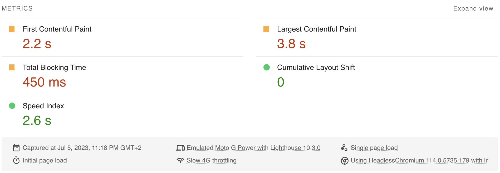
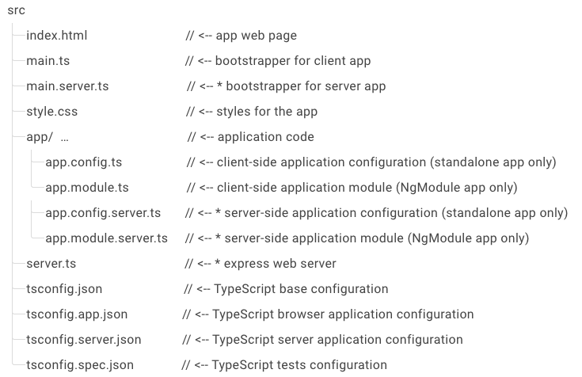
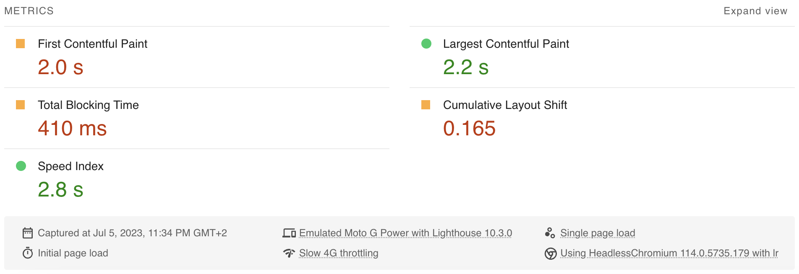
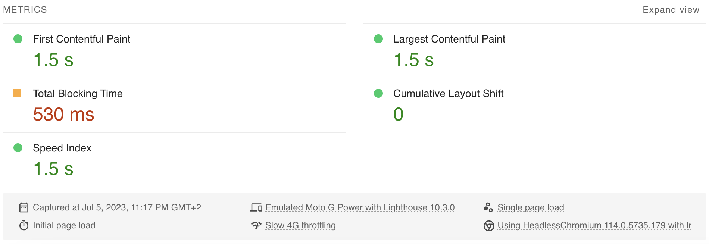

# How to use Angular SSR with Hydration

Part III of the complete guide to Angular 16 Server Side Rendering with Client Hydration

<!-- TOC -->

- [How to use Angular SSR with Hydration](#how-to-use-angular-ssr-with-hydration)
  - [Links to source code and demos](#links-to-source-code-and-demos)
  - [The base case using Client Side Rendering](#the-base-case-using-client-side-rendering)
  - [Step 1 - Implementing Server Side Rendering](#step-1---implementing-server-side-rendering)
  - [Step 2 - Implementing Prerendering of routes](#step-2---implementing-prerendering-of-routes)
  - [Step 3 - Enabling Non-Destructive Hydration](#step-3---enabling-non-destructive-hydration)
  - [Conclusion](#conclusion)
  - [Performance Deep Dive Workshop](#performance-deep-dive-workshop)
  <!-- TOC -->

In **part I**, we discussed the benefits of having a faster Initial Load<!-- @Manfred, please insert link here as well -->. In **part II**, I've introduced some metrics and tools for the measurement of the Initial Load Performance<!-- @Manfred, please insert link here as well -->. Now we want to improve a (tiny) Angular app by adding SSR including Client Hydration.

## Links to source code and demos

To help understanding the **Initial Load Optimization process**, I've made commits for the successive steps. You can find the Git repo with all the used source code here:

- https://gitlab.com/L_X_T/ng-performance-demo

Make sure to check out the **live demo web apps** here:

- [Demo Client Side Rendering](https://csr.tree.angular-software.com/)
- [Demo Server Side Rendering](https://ssr.tree.angular-software.com/)

If you want, you can even run the Google PageSpeed Insights tests used to measure the Initial Load Performance by yourself:

- [PageSpeed Client Side Rendering](https://pagespeed.web.dev/analysis?url=https%3A%2F%2Fcsr.tree.angular-software.com%2F)
- [PageSpeed Server Side Rendering](https://pagespeed.web.dev/analysis?url=https%3A%2F%2Fssr.tree.angular-software.com%2F)

I use the Flight App as the demonstration example. It is a small and simple Angular app. To get realistic results and timings we've added some links to big CSS files (by Bootstrap) and a big Chart library (by AnyChart) - the latter being lazy-loaded at least.

So please don't expect world breaking records here - we just want to demonstrate the improvements by adding SSR, Prerendering & Client Hydration.

## The base case using Client Side Rendering

We want to use a `nginx` container to serve our Angular app called `performance`.

```dockerfile
# Stage 0, Node.js, install deps & build the app
FROM node:16-alpine as builder

# set working directory
RUN mkdir -p /usr/src/app
WORKDIR /usr/src/app

# add app
COPY . /usr/src/app

# install deps and cli
RUN npm install
RUN npm install -g @angular/cli

# add .bin to $PATH
ENV PATH /usr/src/app/node_modules/.bin:$PATH

# build app
RUN ng build

# Stage 1, nginx, copy & serve app
FROM nginx:alpine

COPY --from=builder /usr/src/app/dist/performance/browser /usr/share/nginx/html/
COPY nginx.conf /etc/nginx/conf.d/default.conf
```

Please note that in this `Dockerfile` we assume that `Angular Universal` is already set up and therefore the Angular app resides in a subfolder called `browser`.

To enable **gzip compression** in nginx we need to modify the default nginx.conf. Make sure to add all mime-types that your app is using.

```text
server {
    gzip on;
    gzip_types      application/javascript font/woff image/jpg image/png image/webp image/x-icon text/css text/plain;
    gzip_proxied    no-cache no-store private expired auth;
    gzip_min_length 1024;

    server_name localhost;
    listen      80;
    root        /usr/share/nginx/html;
    index       index.html;

    location / {
        try_files $uri $uri/ /index.html;
    }
}
```

Since we want to serve our Flight App via `https`, we also need to use the secure version of our Flight API.

```diff
-  url = 'http://www.angular.at/api/flight';
-  // url = 'https://demo.angulararchitects.io/api/Flight';
+  // url = 'http://www.angular.at/api/flight';
+  url = 'https://demo.angulararchitects.io/api/Flight';
```

Now let's run our first test on Google PageSpeed Insights:



The base case takes 2.2s to show the FCP and 3.8s for the LCP. There is no CLS.

## Step 1 - Implementing Server Side Rendering

To enable Server-Side Rendering we first need to install `Angular Universal`:

```shell
ng add @nguniversal/express-engine
```

This will add the dependencies and all the configuration files needed to run Angular in SSR mode:



Now we want to use a `Node.js` container to serve our Angular app.

`Node.js` is necessary to be able to render the page on the server.

```dockerfile
# Stage 0, Node.js, install deps, build & run the app
FROM node:16-alpine as builder

# set working directory
RUN mkdir -p /usr/src/app
WORKDIR /usr/src/app

# add app
COPY . /usr/src/app

# install deps and cli
RUN npm install
RUN npm install -g @angular/cli

# add .bin to $PATH
ENV PATH /usr/src/app/node_modules/.bin:$PATH

# build app & server
RUN ng build
RUN ng run performance:server

# build default port
EXPOSE 4000

# start server
CMD ["node", "/usr/src/app/dist/performance/server/main.js"]
```

To be able to use this and not having to guess the `main.js` hash we **disable hashing** in the `angular.json`:

```json
"outputHashing": "none",
```

To enable **gzip compression** we firstly need to add the `compression` npm packages:

```shell
npm i compression --save
npm i @types/compression --save-dev
```

Secondly we need to update the `server.ts`:

```diff
-  server.engine('html', ngExpressEngine({
-    bootstrap: AppServerModule
-  }));
+  server.engine(
+    'html',
+    ngExpressEngine({
+      bootstrap: AppServerModule
+    })
+  );
+
+  // Compress all HTTP responses
+  server.use(compression());
```

So, now let's check the results with SSR:



The server side rendered variant takes 2.0s (-0.2s) to show the FCP and 2.2s (-1.6s) for the LCP. There is a CLS of 0.165 because the page has to be rerendered in the client. It's already much faster than CSR, but you get a CLS which is not good. We can do better than that!

## Step 2 - Implementing Prerendering of routes

Prerendering the routes allows the backend to prerender certain routes which then are cached on the server. So those pages don't have to be prerendered on-the-fly but instead will be delivered from the **static cache** on the server. However, if your App is behind a CDN like CloudFlare which caches each page as well you probably want to omit this step.

In your `Dockerfile` at the following line after build and before the run server:

```dockerfile
# build app, prerender & run server
RUN ng build
RUN ng run performance:prerender
RUN ng run performance:server
```

In your `angular.json` you want to specify which **routes** should be **prerendered**:

```json
"prerender": {
  "builder": "@nguniversal/builders:prerender",
    "options": {
      "routes": ["/", "/home", "/flight-booking/flight-search", "/flight-booking/charts"]
    },
```

Alternatively, you could also use a **text file** for specifying the static pages:

```dockerfile
RUN ng run performance:prerender --routes-file routes.txt
```

Let's check the results with prerendering:


The prerendered SSR variant takes 1.7s (-0.5s) to show the FCP and 2.4s (-1.4s) for the LCP. There is still a CLS of 0.165 because of the rerendering in the client. It's merely faster than the SSR without prerendering. This is because the Angular app is very simple and thus rendering on the server does not take very long.

## Step 3 - Enabling Non-Destructive Hydration

To enable the **Non-Destructive Hydration** feature in Angular all we need to do is to add this provider in the `AppModule`. Of course this only works if we import it from the `@angular/platform-browser` with at least version 16.

```typescript
// app.module.ts
@NgModule({
  providers: [
    [...],
    provideClientHydration()
  ],
})
export class AppModule {}
```

If you're using the standalone bootstrapping you can add the provider to the `ApplicationConfig`.

```typescript
// app.config.ts
export const appConfig: ApplicationConfig = {
  providers: [
    [...],
    provideClientHydration(),
  ]
};
```

Let's check the final results:



The SSR with Client Hydration variant takes 1.5s (-0.7s) to show the FCP and 1.5s (-2.3s) for the LCP. There is no CLS. It's blazingly fast and we get rid of the CLS, because the DOM does not have to be rerendered.

## Conclusion

Server Side Rendering is an effective technique for optimizing Initial Load Performance and delivering a faster, more seamless user experience. Angular V16's Non-Destructive Hydration complements SSR by transforming static HTML into an interactive application on the client-side without having to rerender (and thus repaint in the browser) it completely.

By combining the benefits of SSR & Hydration, your Angular apps can deliver faster initial load times, provide a seamless user experience, and achieve better search engine visibility. In the future the Angular framework will deliver even better Hydration support and features.

In this guide I showed you how easy it is to set up Angular SSR with Hydration and how much the Initial Load Performance improves as a result. So, if your Angular app is publicly available you should start using SSR & Hydration today!

## Performance Deep Dive Workshop

If you want to deep dive into Angular performance, we offer a dedicated [**Performance Workshop**](https://www.angulararchitects.io/en/angular-workshops/angular-performance-workshop/) 🚀 - both in English and German.

This blog series was written by [Alex Thalhammer](https://alex.thalhammer.name/). Follow me on [GitHub](https://github.com/L-X-T), [Twitter](https://twitter.com/LX_T) or [LinkedIn](https://at.linkedin.com/in/thalhammer).
